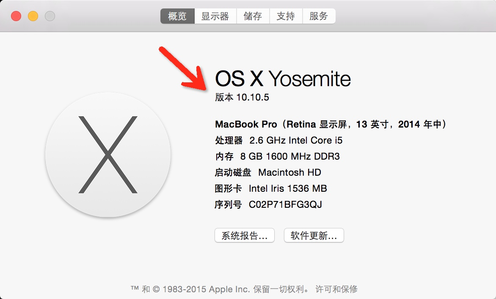
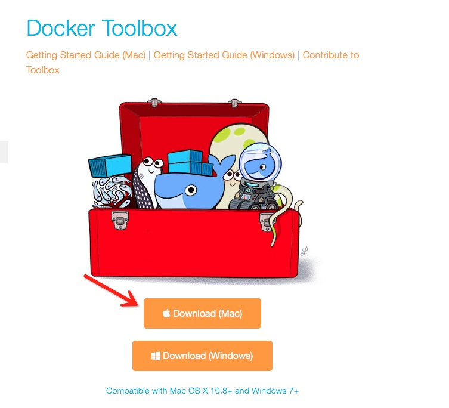
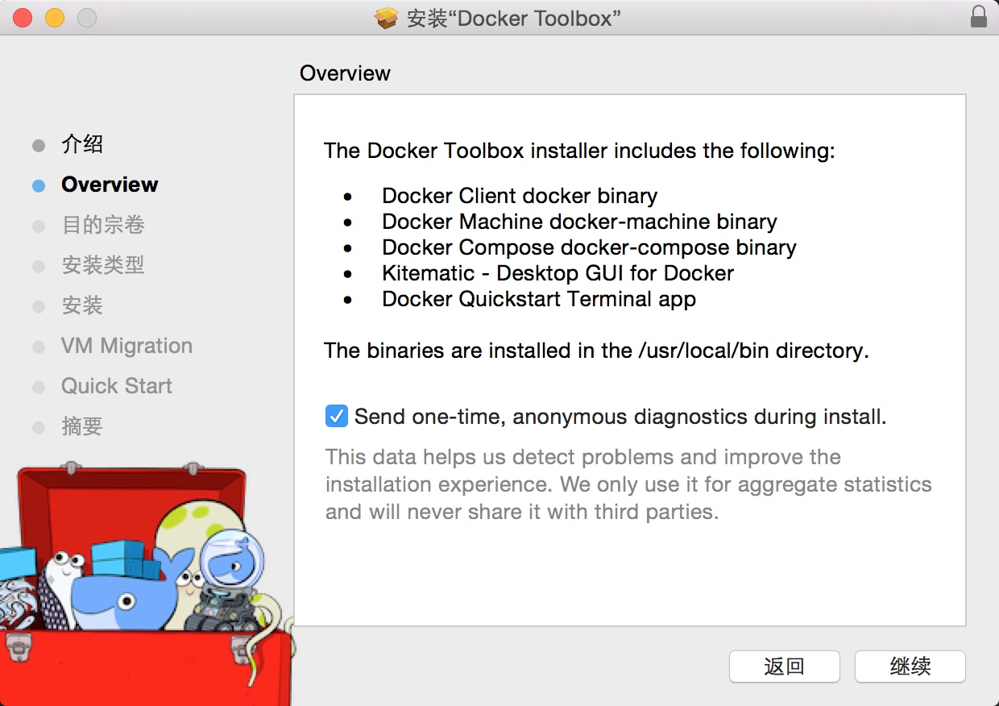
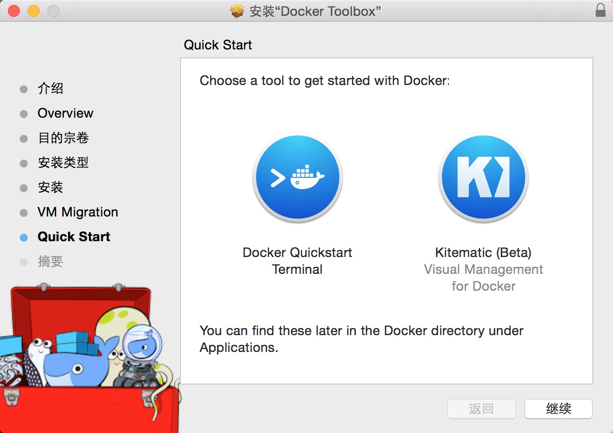
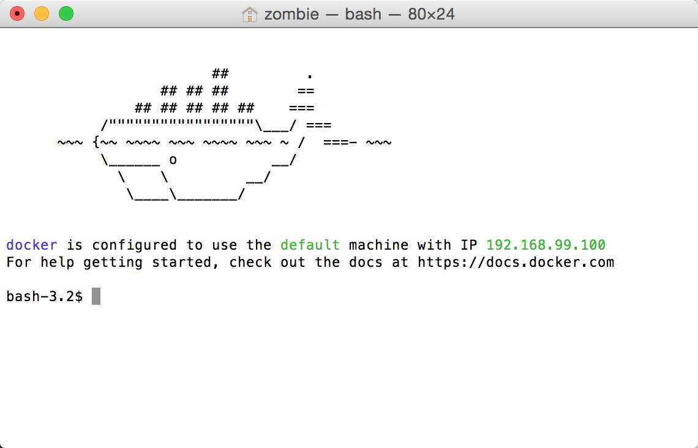

# MAC OS X上安装Docker
[TOC]

使用Doker Toolbox安装Docker。Doker Toolbox包含以下工具：
* 运行编译过的`docker-machine`的Docker Machine
* 运行`docker`的Docker Engine
* 运行`docker-compose`的Docker Compose
* Docker GUI, Kitematic
* 一个支持Docker命令行环境预编译好的shell
* Oracle VM VirtualBox

由于Docker使用Linux特有的内核功能，你无法在OS X中直接运行Docker。相应的，你必须使用`docker-machine`来创建Docker VM到你的机器上。
##检查系统版本
你的mac必须要运行OS X 10.6（雪豹）以上以运行docker。

##安装Docker Toolbox
1. 访问[Docker Toolbox](https://www.docker.com/toolbox)
2. 下载安装文件，这个可能需要翻墙

3. 直接运行安装文件即可，注意安装前如果打开virtualbox，请先退出
	默认的安装位置是`/usr/local/bin`
	

4. 验证安装，为运行Docker容器，你需要：
 * 创建或者启动一个Docker虚拟机
 * 将环境切换到新的VM上
 * 使用`docker`客户端来创建、加载和管理窗口
 
 VM被创建后，你可以尽可能多的重复使用它们，像其它的VM一样，它自己在不同的应用中维护对应的配置。

- 4.1 点击`Docker Quickstart Terminal`开始创建VM

- 4.2 在命令行中输入`docker run hello-world`,如果环境没问题的话，这个命令的输出应该是这样：

```shell 
Unable to find image 'hello-world:latest' locally
Pulling repository docker.io/library/hello-world
af340544ed62: Pulling fs layer 
535020c3e8ad: Download complete
Status: Downloaded newer image for hello-world:latest

Hello from Docker.
This message shows that your installation appears to be working correctly.

To generate this message, Docker took the following steps:
 1. The Docker client contacted the Docker daemon.
 2. The Docker daemon pulled the "hello-world" image from the Docker Hub.
 3. The Docker daemon created a new container from that image which runs the
    executable that produces the output you are currently reading.
 4. The Docker daemon streamed that output to the Docker client, which sent it
    to your terminal.

To try something more ambitious, you can run an Ubuntu container with:
 $ docker run -it ubuntu bash

Share images, automate workflows, and more with a free Docker Hub account:
 https://hub.docker.com
```
至此，Docker安装完成。

