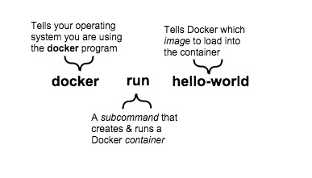

# Docker ON MAC OS X -- 第二篇-了解镜像及容器
[TOC]

在[上一章](http://www.cnblogs.com/qianyiliushang/p/4776826.html)安装的最后一步,运行了`docker run hello-world`命令，这个命令完成的核心的Doker任务，这个命令包含以下三部分：

容器是一个基础版本的Linux操作系统。
镜像是你加载进容器的软件。
当运行这个命令时，Docker应用做了以下事情：
* 检查你是否有`hello-world`镜像
* 从Docker Hub下载镜像(稍后会详细介绍)
* 加进镜像到容器并运行

根据构建的不同，一个镜像可能只是运行一个简单的命令然后退出。这就是`Hello-World`所做的事。
当然，Docker镜像可做更多事，如可以启动一个DB，你可以向里面添加数据，存储数据并将数据提供给其它应用使用。
那么是谁构建的`hello-world`这个镜像呢。在这个例子中，是Docker,但是任何人都可以构建一个镜像。Docker允许个人或者公司通过镜像创建并分享软件。使用Docker，你完全不用担心你的电脑是否在在Docker镜像中运行软件 - Docker容器总是会运行它。

