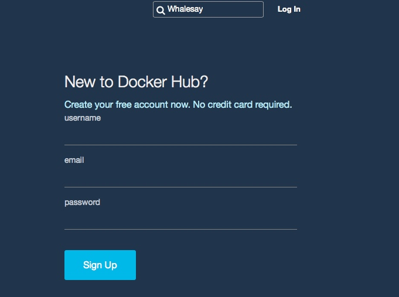
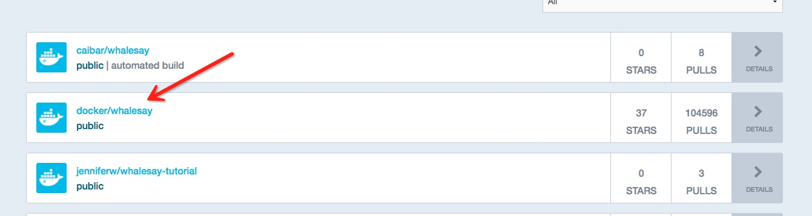
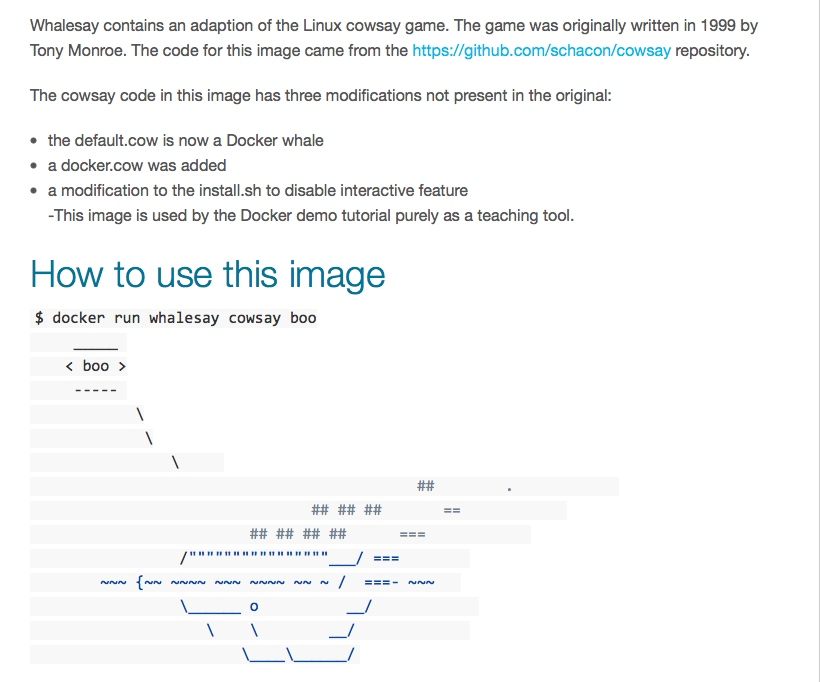

# Docker ON MAC OS X -- 第三篇 - 查找并运行 whalesay镜像

[TOC]

所有的人都可以创建Docker镜像，你可以访问Docker Hub来查找这些镜像。

##查找whalesay镜像
1. 访问[Docker Hub](https://hub.docker.com/?utm_source=getting_started_guide&utm_medium=embedded_MacOSX&utm_campaign=find_whalesay),Docker Hub中有所有来自个人的和官方如google,IBM等公司的镜像。在搜索框输入`Whalesay`
2. 在搜索结果列表中点击**docker/whalesay**镜像
浏览器会打开这个镜像的仓库。镜像仓库包含了该镜像的相关信息如它包含了什么软件、如何运行它。或许你已经注意到了，**Whalesay**是基于Ubuntu的linux分发版本，接下来的步骤将会引导你在你的机器上运行**Whalesay**

##运行whalesay镜像
1. 打开Docker命令行
2. 输入`docker run docker/whalesay cowsay boo`。这条命令会在一个容器中运行**whalesay**

